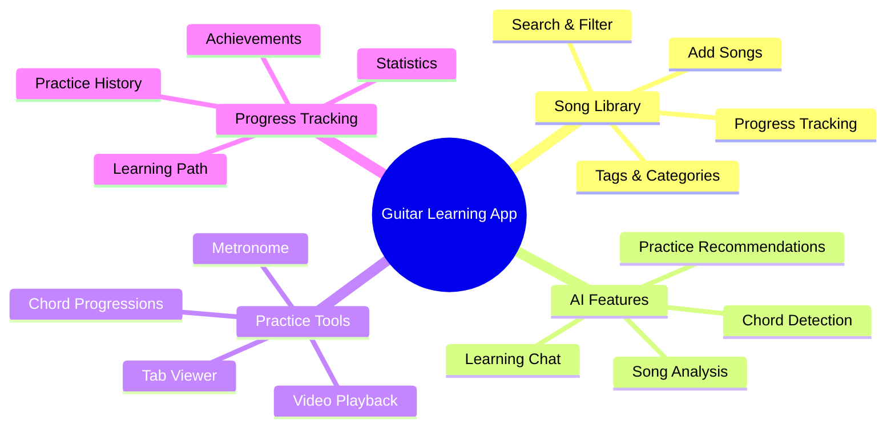

# Guitar Learning App

A professional guitar learning application that helps users break down songs they want to learn through AI-powered analysis and interactive learning features.

## 📋 Overview

Guitar Learning App is a Next.js application designed to help guitarists of all skill levels learn and practice songs more effectively. The app combines AI-powered song analysis, interactive guitar tabs, chord diagrams, and practice tools to provide a comprehensive learning experience.

### App Features Overview



## 🚀 Key Features

- 🎸 **Song Library Management**: Organize songs with progress tracking and difficulty ratings
- 🤖 **AI Song Analysis**: Automatic breakdown of songs with chords, scales, and practice recommendations
- 📝 **Interactive Tabs**: Embedded guitar tablature from Songsterr with playalong features
- 🎯 **Chord Progression Practice**: Interactive tool to master chord transitions with metronome
- 📊 **Progress Tracking**: Visual tracking of practice time and song mastery
- 🎬 **Video Playback**: Custom controls for slowing down, looping sections, and synchronized tabs
- 💬 **Learning Chat**: AI-assisted conversations about specific songs and techniques

## 📝 Documentation

This repository includes several documentation files to help you understand and contribute to the project:

- [Technical Documentation](./TECHNICAL_DOCS.md) - Architecture, components, and implementation details
- [API Documentation](./API_DOCUMENTATION.md) - Setup and usage of OpenAI, Spotify, YouTube, and Songsterr
- [Development Roadmap](./ROADMAP.md) - MVP plan, completed features, and future enhancements

## 🛠️ Setup Instructions

### Prerequisites

- Node.js (v18.0.0 or newer)
- npm or yarn

### Installation

1. Clone the repository:
```bash
git clone https://github.com/yourusername/guitar-learning-app.git
cd guitar-learning-app
```

2. Install dependencies:
```bash
npm install
# or
yarn install
```

3. Set up API keys:
   - Create a `.env.local` file in the root directory
   - Add your API keys following the format in `.env.example`
   - See [API Documentation](./API_DOCUMENTATION.md) for detailed instructions

4. Start the development server:
```bash
npm run dev
# or
yarn dev
```

5. Open [http://localhost:3000](http://localhost:3000) in your browser.

## 🧰 Tech Stack

- **Frontend**: Next.js, React, Tailwind CSS
- **State Management**: React Context API, Zustand
- **Database**: Local storage (plan to implement SQLite through Prisma)
- **AI Integration**: OpenAI API
- **Music APIs**: Songsterr, YouTube, Spotify
- **Animations**: Framer Motion
- **Styling**: Tailwind CSS with dark mode

## 📱 Project Structure

```
├── public/                 # Static assets
├── src/                    # Source code
│   ├── app/                # Next.js App Router
│   │   ├── dashboard/      # Dashboard page
│   │   ├── songs/          # Songs management
│   │   ├── practice/       # Practice session pages
│   │   ├── progress/       # Progress tracking page
│   ├── components/         # Reusable components
│   │   ├── ui/             # UI components
│   │   ├── charts/         # Chart components
│   │   ├── player/         # Video player components
│   │   ├── diagrams/       # Guitar diagrams components
│   │   ├── practice/       # Practice-related components
│   ├── lib/                # Utilities and helpers
│   │   ├── ai/             # AI services
│   │   ├── db/             # Database functions
│   │   ├── services/       # API services
│   ├── data/               # Mock data for development
│   └── styles/             # Global styles
└── scripts/                # Utility scripts
```

## 👩‍💻 Development Status

This project is currently in MVP phase. See [Development Roadmap](./ROADMAP.md) for details on completed features and future plans.

## 🙏 Credits

- [Songsterr](https://www.songsterr.com/) for tab data
- [Uberchord](https://www.uberchord.com/) for chord information
- [Ultimate Guitar](https://www.ultimate-guitar.com/) for additional resources
- [AlphaTab](https://www.alphatab.net/) for music notation rendering

## 📄 License

MIT