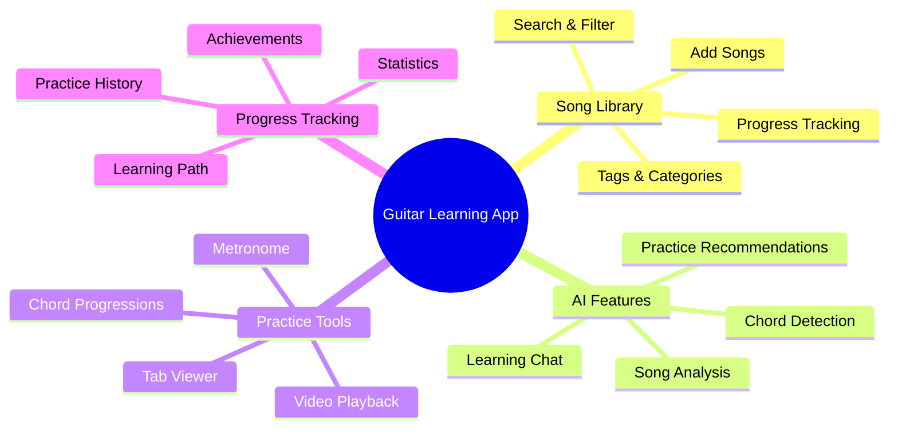

# Guitar Learning App

A professional guitar learning application that helps users break down songs they want to learn through AI-powered analysis and interactive learning features.

## 📋 Overview

Guitar Learning App is a Next.js application designed to help guitarists of all skill levels learn and practice songs more effectively. The app combines AI-powered song analysis, interactive guitar tabs, chord diagrams, and practice tools to provide a comprehensive learning experience.

### App Features Overview


```mermaid
mindmap
  root((Guitar Learning App))
    Song Library
      Search & Filter
      Tags & Categories
      Progress Tracking
      Add Songs
    AI Features
      Song Analysis
      Chord Detection
      Practice Recommendations
      Learning Chat
    Practice Tools
      Chord Progressions
      Metronome
      Video Playback
      Tab Viewer
    Progress Tracking
      Statistics
      Practice History
      Achievements
      Learning Path
```

## 🎸 Guitar Fretboard Visualizer

A powerful, interactive fretboard tool with:
- Tabbed workflow (Fretboard, Voicings, Analysis, Patterns, Progressions)
- Dynamic chord voicings for all roots and types
- Interactive fretboard with note/interval highlighting and sound playback
- Mini floating legend with toggleable visibility
- Prominent chord diagrams and alternative fingerings
- Scale patterns and chord progressions views
- Responsive, accessible UI with mobile support
- Modular, maintainable code structure

### Code Structure
```
├── components/
│   ├── fretboard/
│   │   ├── FretboardPage.jsx
│   │   ├── NoteCell.jsx
│   │   ├── VoicingDisplay.jsx
│   │   ├── ChordPositions.jsx
│   │   ├── ScalePatterns.jsx
│   │   ├── ChordProgressions.jsx
│   │   └── LegendBox.jsx
```

## 🎸 Tab Engine & Renderer

The application includes a robust tab engine with multiple rendering options for guitar tablature:

### How It Works

1. **Tab Data Flow**:
   - Tabs are loaded via `getTabForSong()` which implements a fallback chain:
     1. Checks cache
     2. Tries hardcoded samples
     3. Attempts to scrape tab data
     4. Falls back to API calls
     5. Generates basic tabs as last resort

2. **Rendering Components**:
   - `TabRenderer`: Basic VexFlow-based renderer for single-stave tabs
   - `SimpleTabRenderer`: Advanced renderer with multi-stave support and error handling
   - `InlineTabRenderer`: Lightweight renderer for simple tab display

3. **Key Files**:
   ```
   src/components/tabs/
   ├── TabRenderer.jsx       # Main tab rendering component
   ├── SimpleTabRenderer.jsx # Advanced tab rendering with error handling
   └── InlineTabRenderer.jsx # Lightweight tab display
   
   src/components/songs/
   └── SongTabViewer.jsx    # Tab viewing interface with tab switching
   
   src/lib/services/
   ├── tabFetcherService.js # Handles tab data retrieval
   └── songsterrApi.js      # Songsterr API integration
   ```

4. **Fretboard Integration**:
   - The fretboard visualizer can display tab notes with consistent styling
   - Nut is positioned between 0 and 1st frets
   - Fret 0 notes have consistent styling with other frets
   - String labels are displayed in a separate column

### What Needs to Be Implemented for Tab Loading

To properly load specific tabs on a page:

1. **Tab Selection Mechanism**: Currently missing a clear way to load specific tabs based on user selection or URL parameters.
2. **Integration with Router**: Need to handle route parameters to load specific tabs by ID.
3. **Tab Database/Repository**: A structured way to store and retrieve tabs beyond the current hardcoded samples.
4. **Error Boundaries**: Better handling of cases where tab data is genuinely unavailable or malformed.

### To Visualize Tabs on the Fretboard

1. **Tab-to-Fretboard Conversion**: Create utility to translate tab positions (string/fret) to fretboard notes.
2. **Time-based Navigation**: Add controls to step through tab measures and highlight corresponding notes.
3. **Two-way Interaction**: Allow clicking fretboard notes to highlight corresponding tab positions.
4. **Visual Synchronization**: Ensure tab and fretboard scroll/highlight in sync during playback.

### Todo List for Tab Functionality

- [ ] **Tab Selection & Routing**
  - [ ] Implement URL-based tab selection
  - [ ] Add tab browser with search and filtering
  - [ ] Support tab collections and playlists

- [ ] **Rendering Improvements**
  - [ ] Add support for Guitar Pro files
  - [ ] Implement scrolling tab playback
  - [ ] Add note highlighting during playback
  - [ ] Support for different tunings
  - [ ] Improve tab-to-fretboard synchronization

- [ ] **Interactive Features**
  - [ ] Click-to-play functionality
  - [ ] Looping sections
  - [ ] Speed control for practice
  - [ ] Tab annotation tools

- [ ] **Integration**
  - [ ] Connect tab player with metronome
  - [ ] Add tab-to-chord diagram conversion
  - [ ] Implement tab transposition
  - [ ] Add tab difficulty ratings

- [ ] **Performance**
  - [ ] Optimize tab rendering for large files
  - [ ] Implement virtualized scrolling for long tabs
  - [ ] Add tab caching and offline support

## 🕸️ Tonnetz Chord Visualizer (Planned)
- Interactive Tonnetz navigation
- Chord/scale relationships visualized on a Tonnetz grid
- Advanced analysis and ear training features

## 🚀 Key Features (Updated)
- Tabbed workflow for contextual views
- Dynamic chord voicings and alternative fingerings
- Interactive, accessible fretboard
- Mini floating legend
- Scale patterns and chord progressions
- Tonnetz visualizer (planned)
- Improved accessibility and mobile support (planned)
- Modular, maintainable code

## 🤖 AI Chat with RAG Functionality

The Guitar Learning App now features an intelligent AI chat assistant that helps users with guitar practice, music theory, and learning techniques using Retrieval-Augmented Generation (RAG) technology.

### Key Features

- **Personalized Guitar Assistant**: Get tailored advice on guitar techniques, practice routines, and music theory
- **Context-Aware Responses**: The AI understands guitar-specific terminology and concepts
- **Knowledge Base**: Powered by a comprehensive guitar education knowledge base
- **Persistent Chat History**: Your conversations are saved between sessions
- **Suggested Prompts**: Get started quickly with pre-made questions

### How It Works

The chat system uses a combination of:

1. **Retrieval-Augmented Generation (RAG)**: 
   - Queries are matched against a knowledge base of guitar education content
   - Most relevant information is retrieved and used to inform the AI's responses
   - Ensures accurate and specific answers about guitar techniques and theory

2. **Conversational AI**:
   - Built on OpenAI's GPT-4 model
   - Maintains conversation context
   - Provides natural, helpful responses

3. **Local Storage**:
   - Chat history is saved in your browser
   - API keys are stored securely locally

### Getting Started

1. Click on "AI Coach" in the sidebar
2. Enter your OpenAI API key in the settings (gear icon) if prompted
3. Start asking questions about guitar playing, music theory, or practice techniques

### Example Queries

- "What are some good warm-up exercises?"
- "How do I improve my chord transitions?"
- "Explain the CAGED system"
- "Help me create a practice routine"
- "What's the best way to learn barre chords?"

### Privacy Note

- Your API key is stored only in your browser's local storage
- Chat history is stored locally and not sent to any server
- No personal data is collected

## AI Functionality
- AI-powered song analysis
- Chord detection
- Practice routines built from AI analysis (goals, current skill level, youtube videos, etc.)

## 👩‍💻 Development Status (Updated)
- Fretboard visualizer refactored and improved
- Voicings, analysis, patterns, and progressions tabs implemented
- Code structure modularized for maintainability
- Tonnetz visualizer and advanced analysis planned
- Test coverage and refactoring in progress

See [todo.md](./todo.md) for detailed roadmap and recent changes.

## 📝 Documentation

This repository includes several documentation files to help you understand and contribute to the project:

- [Technical Documentation](./TECHNICAL_DOCS.md) - Architecture, components, and implementation details
- [API Documentation](./API_DOCUMENTATION.md) - Setup and usage of OpenAI, Spotify, YouTube, and Songsterr
- [Development Roadmap](./ROADMAP.md) - MVP plan, completed features, and future enhancements

## 🛠️ Setup Instructions

### Prerequisites

- Node.js (v18.0.0 or newer)
- npm or yarn

### Installation

1. Clone the repository:
```bash
git clone https://github.com/yourusername/guitar-learning-app.git
cd guitar-learning-app
```

2. Install dependencies:
```bash
npm install
# or
yarn install
```

3. Set up API keys:
   - Create a `.env.local` file in the root directory
   - Add your API keys following the format in `.env.example`
   - See [API Documentation](./API_DOCUMENTATION.md) for detailed instructions

4. Start the development server:
```bash
npm run dev
# or
yarn dev
```

5. Open [http://localhost:3000](http://localhost:3000) in your browser.

## 🧰 Tech Stack

- **Frontend**: Next.js, React, Tailwind CSS
- **State Management**: React Context API, Zustand
- **Database**: Local storage (plan to implement SQLite through Prisma)
- **AI Integration**: OpenAI API
- **Music APIs**: Songsterr, YouTube, Spotify
- **Animations**: Framer Motion
- **Styling**: Tailwind CSS with dark mode

## 📱 Project Structure

```
├── public/                 # Static assets
├── src/                    # Source code
│   ├── app/                # Next.js App Router
│   │   ├── dashboard/      # Dashboard page
│   │   ├── songs/          # Songs management
│   │   ├── practice/       # Practice session pages
│   │   ├── progress/       # Progress tracking page
│   ├── components/         # Reusable components
│   │   ├── ui/             # UI components
│   │   ├── charts/         # Chart components
│   │   ├── player/         # Video player components
│   │   ├── diagrams/       # Guitar diagrams components
│   │   ├── practice/       # Practice-related components
│   ├── lib/                # Utilities and helpers
│   │   ├── ai/             # AI services
│   │   ├── db/             # Database functions
│   │   ├── services/       # API services
│   ├── data/               # Mock data for development
│   └── styles/             # Global styles
└── scripts/                # Utility scripts
```

## 🙏 Credits

- [Songsterr](https://www.songsterr.com/) for tab data
- [Uberchord](https://www.uberchord.com/) for chord information
- [Ultimate Guitar](https://www.ultimate-guitar.com/) for additional resources
- [AlphaTab](https://www.alphatab.net/) for music notation rendering

## 📄 License

MIT
