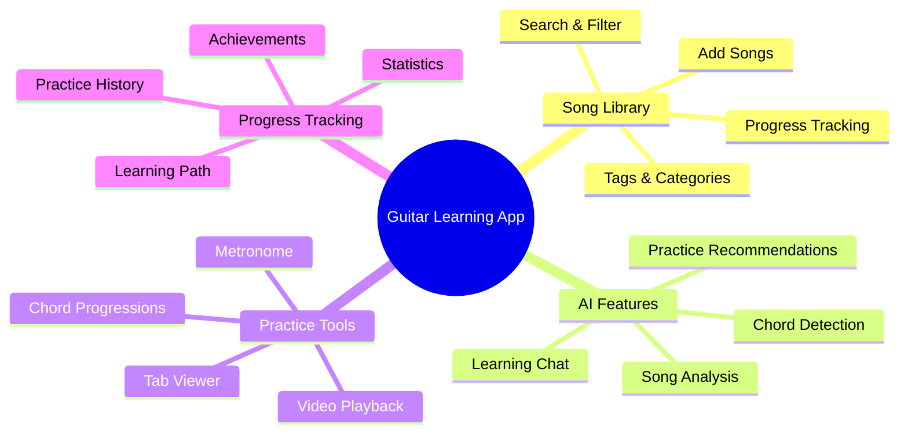

# Guitar Learning App

A professional guitar learning application that helps users break down songs they want to learn through AI-powered analysis and interactive learning features.

## 📋 Overview

Guitar Learning App is a Next.js application designed to help guitarists of all skill levels learn and practice songs more effectively. The app combines AI-powered song analysis, interactive guitar tabs, chord diagrams, and practice tools to provide a comprehensive learning experience.

### App Features Overview


```mermaid
mindmap
  root((Guitar Learning App))
    Song Library
      Search & Filter
      Tags & Categories
      Progress Tracking
      Add Songs
    AI Features
      Song Analysis
      Chord Detection
      Practice Recommendations
      Learning Chat
    Practice Tools
      Chord Progressions
      Metronome
      Video Playback
      Tab Viewer
    Progress Tracking
      Statistics
      Practice History
      Achievements
      Learning Path
```

## 🎸 Guitar Fretboard Visualizer

A powerful, interactive fretboard tool with:
- Tabbed workflow (Fretboard, Voicings, Analysis, Patterns, Progressions)
- Dynamic chord voicings for all roots and types
- Interactive fretboard with note/interval highlighting and sound playback
- Mini floating legend with toggleable visibility
- Prominent chord diagrams and alternative fingerings
- Scale patterns and chord progressions views
- Responsive, accessible UI with mobile support
- Modular, maintainable code structure

### Code Structure
```
├── components/
│   ├── fretboard/
│   │   ├── FretboardPage.jsx
│   │   ├── NoteCell.jsx
│   │   ├── VoicingDisplay.jsx
│   │   ├── ChordPositions.jsx
│   │   ├── ScalePatterns.jsx
│   │   ├── ChordProgressions.jsx
│   │   ├── LegendBox.jsx
│   │   └── TonnetzVisualizer.jsx (planned)
```

## 🕸️ Tonnetz Chord Visualizer (Planned)
- Interactive Tonnetz navigation
- Chord/scale relationships visualized on a Tonnetz grid
- Advanced analysis and ear training features

## 🚀 Key Features (Updated)
- Tabbed workflow for contextual views
- Dynamic chord voicings and alternative fingerings
- Interactive, accessible fretboard
- Mini floating legend
- Scale patterns and chord progressions
- Tonnetz visualizer (planned)
- Improved accessibility and mobile support (planned)
- Modular, maintainable code

## AI Functionality
- AI-powered song analysis
- Chord detection
- Practice routines built from AI analysis (goals, current skill level, youtube videos, etc.)
- Learning chat

## 👩‍💻 Development Status (Updated)
- Fretboard visualizer refactored and improved
- Voicings, analysis, patterns, and progressions tabs implemented
- Code structure modularized for maintainability
- Tonnetz visualizer and advanced analysis planned
- Test coverage and refactoring in progress

See [todo.md](./todo.md) for detailed roadmap and recent changes.

## 📝 Documentation

This repository includes several documentation files to help you understand and contribute to the project:

- [Technical Documentation](./TECHNICAL_DOCS.md) - Architecture, components, and implementation details
- [API Documentation](./API_DOCUMENTATION.md) - Setup and usage of OpenAI, Spotify, YouTube, and Songsterr
- [Development Roadmap](./ROADMAP.md) - MVP plan, completed features, and future enhancements

## 🛠️ Setup Instructions

### Prerequisites

- Node.js (v18.0.0 or newer)
- npm or yarn

### Installation

1. Clone the repository:
```bash
git clone https://github.com/yourusername/guitar-learning-app.git
cd guitar-learning-app
```

2. Install dependencies:
```bash
npm install
# or
yarn install
```

3. Set up API keys:
   - Create a `.env.local` file in the root directory
   - Add your API keys following the format in `.env.example`
   - See [API Documentation](./API_DOCUMENTATION.md) for detailed instructions

4. Start the development server:
```bash
npm run dev
# or
yarn dev
```

5. Open [http://localhost:3000](http://localhost:3000) in your browser.

## 🧰 Tech Stack

- **Frontend**: Next.js, React, Tailwind CSS
- **State Management**: React Context API, Zustand
- **Database**: Local storage (plan to implement SQLite through Prisma)
- **AI Integration**: OpenAI API
- **Music APIs**: Songsterr, YouTube, Spotify
- **Animations**: Framer Motion
- **Styling**: Tailwind CSS with dark mode

## 📱 Project Structure

```
├── public/                 # Static assets
├── src/                    # Source code
│   ├── app/                # Next.js App Router
│   │   ├── dashboard/      # Dashboard page
│   │   ├── songs/          # Songs management
│   │   ├── practice/       # Practice session pages
│   │   ├── progress/       # Progress tracking page
│   ├── components/         # Reusable components
│   │   ├── ui/             # UI components
│   │   ├── charts/         # Chart components
│   │   ├── player/         # Video player components
│   │   ├── diagrams/       # Guitar diagrams components
│   │   ├── practice/       # Practice-related components
│   ├── lib/                # Utilities and helpers
│   │   ├── ai/             # AI services
│   │   ├── db/             # Database functions
│   │   ├── services/       # API services
│   ├── data/               # Mock data for development
│   └── styles/             # Global styles
└── scripts/                # Utility scripts
```

## 🙏 Credits

- [Songsterr](https://www.songsterr.com/) for tab data
- [Uberchord](https://www.uberchord.com/) for chord information
- [Ultimate Guitar](https://www.ultimate-guitar.com/) for additional resources
- [AlphaTab](https://www.alphatab.net/) for music notation rendering

## 📄 License

MIT