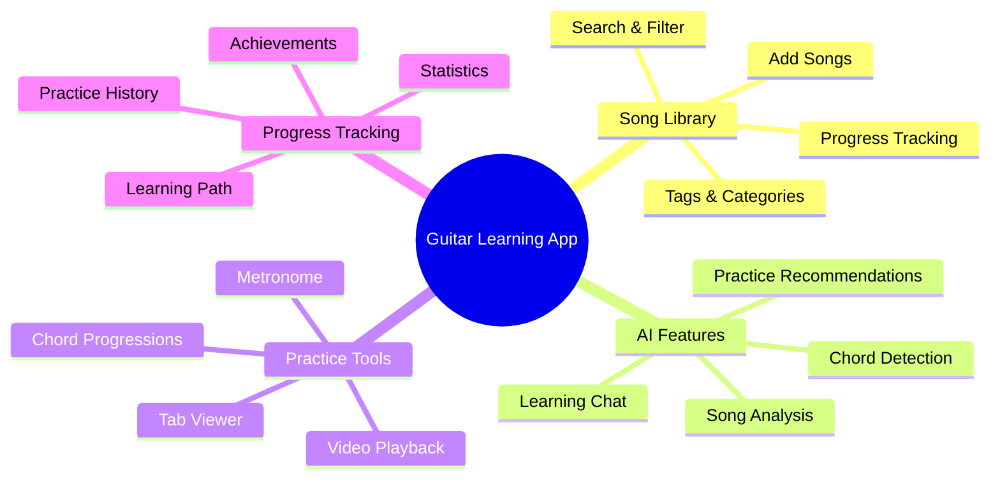

# Guitar Learning App

A professional guitar learning application that helps users break down songs they want to learn through AI-powered analysis and interactive learning features.

## 📋 Overview

The Guitar Learning App is built with Next.js and offers a full-featured environment for learning guitar through:
	•	AI-powered song analysis
	•	Interactive guitar fretboard visualizations
	•	Chord diagrams and scale patterns
	•	Practice tracking and personalized routines

⸻

🎸 Guitar Learning App

A professional guitar learning platform combining AI-powered analysis with interactive practice tools to help users break down and master songs.

🌟 Key Features

🎼 Song Library
	•	Search, filter, and organize songs
	•	Tagging and categorization
	•	Quick and advanced song add flows
	•	Chord previews and embedded YouTube videos

🤖 AI Features
	•	Chord and progression detection
	•	Song breakdown with difficulty estimation
	•	Personalized practice plans
	•	AI-powered learning chat

🎯 Practice Tools
	•	Interactive fretboard and chord builder
	•	Scale patterns and chord progressions
	•	Video playback, metronome, and tab viewer
	•	Practice history, stats, and achievements

🎸 Fretboard Visualizer
	•	Tabbed views: Fretboard, Voicings, Patterns, Progressions
	•	Interval highlighting and sound playback
	•	Chord diagrams and alternative fingerings
	•	Mobile-responsive and accessible UI

🧠 Tonnetz Visualizer (Planned)
	•	Interactive Tonnetz grid
	•	Visualize chord/scale relationships
	•	Advanced ear training tools

⸻

🗂️ File Structure

├── public/                 # Static assets
├── src/                    # Main source code
│   ├── app/                # Next.js App Router
│   │   ├── dashboard/      # Dashboard page
│   │   ├── songs/          # Songs management
│   │   ├── practice/       # Practice session pages
│   │   ├── progress/       # Progress tracking
│   ├── components/         # Reusable components
│   │   ├── ui/             # General UI
│   │   ├── charts/         # Charts and visualizations
│   │   ├── player/         # Video players
│   │   ├── diagrams/       # Fretboard and chord diagrams
│   │   ├── practice/       # Practice tools
│   ├── lib/                # Utilities and APIs
│   │   ├── ai/             # AI integration
│   │   ├── db/             # Database utils
│   │   ├── services/       # External APIs
│   ├── data/               # Mock data
│   └── styles/             # Global stylesheets
├── scripts/                # Tab scraping and utility scripts
├── tests/                  # Jest tests

⸻

```mermaid
mindmap
  root((Guitar Learning App))
    Song Library
      Search & Filter
      Tags & Categories
      Progress Tracking
      Add Songs
    AI Features
      Song Analysis
      Chord Detection
      Practice Recommendations
      Learning Chat
    Practice Tools
      Chord Progressions
      Metronome
      Video Playback
      Tab Viewer
    Progress Tracking
      Statistics
      Practice History
      Achievements
      Learning Path
```

⸻

🧰 Tech Stack
	•	Frontend: Next.js, React, Tailwind CSS
	•	State Management: React Context API, Zustand
	•	AI: OpenAI API
	•	APIs: Songsterr, YouTube, Spotify, Uberchord
	•	Animations: Framer Motion
	•	Audio: Tone.js
	•	Testing: Jest, React Testing Library
	•	Planned DB: SQLite via Prisma

⸻

⚙️ Setup Instructions

Prerequisites
	•	Node.js v18+
	•	npm or yarn

Install & Run

git clone https://github.com/yourusername/guitar-learning-app.git
cd guitar-learning-app

npm install        # or yarn install
cp .env.example .env.local  # Add your API keys
npm run dev        # or yarn dev

Visit http://localhost:3000

⸻

🧩 Component Highlights
	•	QuickAddSong: One-click song search and addition
	•	AddSongForm: Advanced entry with metadata
	•	SongTabViewer: Loads tabs via Songsterr
	•	SongVideoResources: Embeds YouTube lessons
	•	FretboardGrid: Interactive fretboard matrix
	•	ChordBuilderPanel: Root/type selector and voicing browser
	•	DisplaySettings: Toggle intervals, tunings, and visuals

⸻

📈 Practice & Progress
	•	Track sessions with progression player
	•	View charts and achievements
	•	AI-driven suggestions based on history and difficulty

⸻

🔬 AI & Discovery
	•	src/lib/ai handles OpenAI-powered song breakdown
	•	musicDiscoveryApi.js unifies multi-source search
	•	Fallback mappings in app/services/tabUrlMappings.js

⸻

🎓 Documentation
	•	Technical Documentation
	•	API Docs
	•	Roadmap
	•	Todo List

⸻

🛠 Development Status
	•	✅ Fretboard visualizer refactored
	•	✅ Practice and analysis tabs implemented
	•	✅ Modularized codebase
	•	🛠️ Tonnetz visualizer in planning
	•	🧪 Test coverage and CI in progress

⸻

🧾 TODO (Next Steps)

The codebase contains additional features that are still being wired up in the UI or documented in detail:

- **Tab caching service** for reducing repeated API requests
- **AI feedback** Integrated AI chat feedback
- **Tab search and scraping utilities** using DuckDuckGo and site-specific scrapers
- **YouTube Tab Player** component for locating scrolling tab videos
- **Chord Progression Player** with built-in metronome and countdown
- **Local chat history** stored in the browser for each song
- **Song discovery service** that aggregates results from multiple music APIs

⸻

🙏 Credits
	•	Songsterr
	•	Uberchord
	•	Ultimate Guitar
	•	AlphaTab

⸻

📄 License

MIT License

⸻

Let me know if you’d like this saved to a .md file for download or if you’d like a version optimized for publishing (e.g., GitHub Pages or a Notion wiki).
