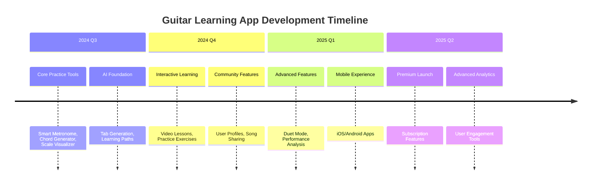
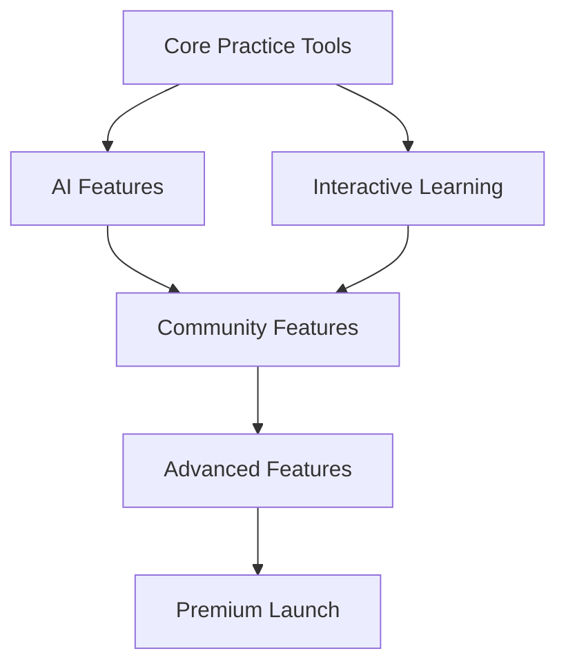

# Guitar Learning App - Development Roadmap

## 🗺️ Visual Roadmap

### Development Timeline



### Feature Dependencies



*Note: Hover over the timeline items for more details. See detailed implementation notes below.*

---

# Guitar Learning App - Development Roadmap

This document outlines the planned development phases, features, and technical considerations for the Guitar Learning App.

## 🗓️ Development Phases

### Phase 1: Adapt Existing Components for Chat

**1.1 ChatFretboard Component**
- **File**: `/src/components/chat/ChatFretboard.jsx`
- **Purpose**: Lightweight wrapper around TabFretboardVisualizer for chat
- **Props**:
  ```javascript
  {
    notes: [
      { string: 1, fret: 1, note: 'F', duration: 'q' },
      { string: 2, fret: 3, note: 'D', duration: 'e' }
    ],
    tuning: ['E2', 'A2', 'D3', 'G3', 'B3', 'E4'],
    width: '100%',
    maxWidth: 400,
    interactive: true,
    showControls: true
  }
  ```
- **Implementation**:
  - Use TabFretboardVisualizer as base
  - Simplify controls for chat context
  - Add responsive sizing

**1.2 ChatChord Component**
- **File**: `/src/components/chat/ChatChord.jsx`
- **Purpose**: Display chords using ChordBuilderPanel's visualization
- **Props**:
  ```javascript
  {
    chord: 'C',                    // Chord name (e.g., 'Cmaj7', 'Dm7')
    voicing: [                      // Optional specific voicing
      { string: 5, fret: 3 },
      { string: 4, fret: 2 },
      { string: 3, fret: 0 },
      { string: 2, fret: 1 },
      { string: 1, fret: 0 }
    ],
    showInfo: true,                // Show chord name and type
    interactive: false,             // Allow changing voicings
    size: 'medium'                  // 'small' | 'medium' | 'large'
  }
  ```
- **Implementation**:
  - Extract visualization logic from ChordBuilderPanel
  - Create a simplified, responsive chord display
  - Add touch-friendly controls for mobile

### Phase 2: AI-Enhanced Learning (Weeks 5-8)
**Goal**: Leverage AI to personalize the learning experience.

#### Features:
1. **AI-Powered Tab Generation**
   - Audio analysis for tab creation
   - Difficulty adjustment
   - Fingering suggestions
   - *Tech*: Audio feature extraction, machine learning models

2. **Personalized Learning Paths**
   - Skill assessment quiz
   - Custom practice routines
   - Progress tracking
   - *Tech*: User profiles, recommendation algorithms

3. **Interactive Lessons**
   - Video integration
   - Interactive exercises
   - Real-time feedback
   - *Tech*: Video.js, WebRTC for recording

### Phase 3: Chat Message Parser & Renderer

**3.1 Message Parser**
- **File**: `/src/lib/chat/messageParser.js`
- **Purpose**: Parse chat messages and detect music notation
- **Key Functions**:
  ```javascript
  import { parseChordNotation } from '@/lib/musicTheory/parser';
  
  function parseMessageContent(content) {
    // Parse tablature blocks
    const tabMatches = [...content.matchAll(/```tab\n([\s\S]*?)\n```/g)];
    
    // Parse chord blocks (both simple and detailed formats)
    const chordMatches = [
      ...content.matchAll(/\[([A-Ga-g][#b]?[^\]]*)\]/g),  // Simple [C], [Am7]
      ...content.matchAll(/```chord\n([\s\S]*?)\n```/g)     // Detailed chord objects
    ];
    
    // Parse interactive fretboard
    const fretboardMatches = [...content.matchAll(/```fretboard\n([\s\S]*?)\n```/g)];
    
    // Process chord matches
    const chords = chordMatches.map(match => {
      try {
        // Try parsing as JSON first (for detailed chord objects)
        return JSON.parse(match[1]);
      } catch {
        // Fall back to simple chord notation
        return parseChordNotation(match[1]);
      }
    });
    
    return {
      text: content,
      tabs: tabMatches.map(m => m[1]),
      chords: chords.length ? chords : null,
      fretboards: fretboardMatches.map(m => JSON.parse(m[1]))
    };
  }
  ```

### Backend Services
- **API**: Next.js API routes
- **Database**: PostgreSQL with Prisma ORM
- **Authentication**: NextAuth.js
- **File Storage**: AWS S3 or similar

### AI/ML Components
- **Tab Generation**: Pre-trained models for audio analysis
- **Recommendations**: Collaborative filtering + content-based filtering
- **Performance Analysis**: Signal processing for audio analysis

### Infrastructure
- **Hosting**: Vercel for frontend, Railway for backend
- **CI/CD**: GitHub Actions
- **Monitoring**: Sentry for error tracking
- **Analytics**: Custom event tracking

## 📅 Timeline

### Q3 2024: Foundation
- [x] Core UI components
- [x] Basic fretboard visualization
- [x] Initial AI chat implementation
- [ ] Smart metronome
- [ ] Chord progression generator

### Q4 2024: AI Integration
- [ ] AI-powered tab generation
- [ ] Personalized learning paths
- [ ] Interactive lessons
- [ ] User progress tracking

### Q1 2025: Community Features
- [ ] User profiles
- [ ] Cover song sharing
- [ ] Duet mode
- [ ] Challenges system

### Q2 2025: Polish & Scale
- [ ] Performance optimizations
- [ ] Mobile app development
- [ ] Advanced analytics
- [ ] Premium features

## 🔄 Version History

### v1.0.0 - Initial Release (Planned: September 2024)
- Core practice tools
- Basic AI chat
- Simple tab viewer

### v1.1.0 - AI Enhancements (Planned: November 2024)
- Tab generation
- Learning paths
- Progress tracking

### v1.2.0 - Community (Planned: February 2025)
- User profiles
- Social features
- Performance analysis

## 📊 Success Metrics

### Key Performance Indicators (KPIs)
- Monthly Active Users (MAU)
- Average Session Duration
- Feature Adoption Rate
- User Retention (7/30/90 day)
- Conversion to Premium

## 🤝 Contributing

We welcome contributions! Please see our [Contributing Guidelines](CONTRIBUTING.md) for details on how to get involved.

## 📝 License

This project is licensed under the MIT License - see the [LICENSE](LICENSE) file for details.
