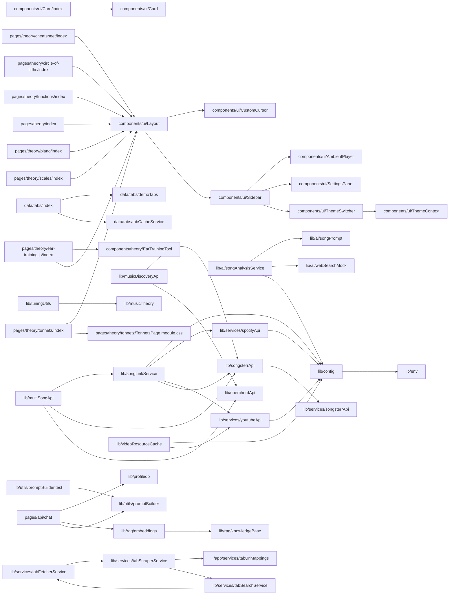

# Code Structure

This document provides an overview of the project's code structure and module dependencies.

## Module Dependencies



## Module Descriptions

- **src/pages/**: Next.js page components
- **src/components/**: Reusable UI components
- **src/lib/**: Utility functions and shared logic
- **src/styles/**: Global styles and themes

## How to Update

This diagram is automatically generated. To update it, run:

```bash
node scripts/generate-docs.js
```
