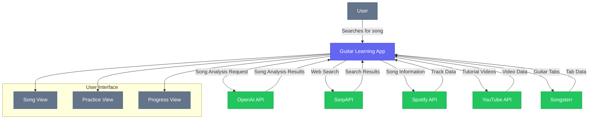

# API Documentation

This document provides comprehensive instructions for setting up and using the various APIs integrated with the Guitar Learning App.

## Overview

The Guitar Learning App integrates with several external APIs to provide rich functionality:

1. **OpenAI API**: Powers the AI song analysis and chat assistant
2. **SerpAPI**: Enhances AI analysis with web search capabilities
3. **Spotify API**: Retrieves track information and enables playback
4. **YouTube API**: Fetches guitar tutorials and music videos
5. **Songsterr**: Displays interactive guitar tabs

### API Integration Flow



## OpenAI & SerpAPI Setup

### Step 1: Get Your API Keys

#### OpenAI API Key
1. Go to [OpenAI's Platform](https://platform.openai.com/api-keys)
2. Create an account or log in
3. Navigate to the API keys section
4. Click "Create new secret key"
5. Give your key a name (e.g., "GuitarCoach App")
6. Copy the API key (you won't be able to see it again)

#### SerpAPI Key
1. Go to [SerpAPI](https://serpapi.com/dashboard)
2. Create an account or log in
3. You'll find your API key on the dashboard
4. Copy the API key

### Step 2: Set Environment Variables

There are two ways to add your API keys to the application:

#### Option 1: Using a .env.local File (Recommended)

1. Create a file named `.env.local` in the root directory of your project
2. Add the following lines to the file:
```
NEXT_PUBLIC_OPENAI_API_KEY=your_openai_api_key_here
NEXT_PUBLIC_SERPAPI_KEY=your_serpapi_key_here
```
3. Replace `your_openai_api_key_here` and `your_serpapi_key_here` with your actual API keys
4. Save the file

#### Option 2: Edit the Config File Directly

If you're just testing or developing locally, you can also set the keys directly in the config file:

1. Open `src/lib/config.js`
2. Replace the placeholder values with your actual API keys:
```javascript
export const API_KEYS = {
  OPENAI_API_KEY: "your_actual_openai_key_here",
  SERPAPI_KEY: "your_actual_serpapi_key_here"
};
```

## Spotify & YouTube API Setup

### Spotify API Setup

1. Go to the [Spotify Developer Dashboard](https://developer.spotify.com/dashboard/)
2. Log in with your Spotify account (create one if needed)
3. Click "Create an App"
4. Fill in the app name and description (e.g., "Guitar Learning App")
5. Accept the terms and create the app
6. Once created, note your **Client ID** and **Client Secret**

### YouTube API Setup

1. Go to the [Google Cloud Console](https://console.cloud.google.com/)
2. Create a new project (or select an existing one)
3. Navigate to "APIs & Services" > "Library"
4. Search for "YouTube Data API v3" and enable it
5. Go to "APIs & Services" > "Credentials"
6. Click "Create Credentials" > "API Key"
7. Copy your new **API Key**

### Environment Configuration

1. Add your API keys to your `.env.local` file:

```
NEXT_PUBLIC_SPOTIFY_CLIENT_ID=your_spotify_client_id_here
NEXT_PUBLIC_SPOTIFY_CLIENT_SECRET=your_spotify_client_secret_here
NEXT_PUBLIC_YOUTUBE_API_KEY=your_youtube_api_key_here
```

2. Enable the APIs by setting the feature flags:

```
NEXT_PUBLIC_USE_REAL_SPOTIFY_API=true
NEXT_PUBLIC_USE_REAL_YOUTUBE_API=true
```

## Songsterr Tab Integration

The app uses [Songsterr](https://www.songsterr.com/) to display interactive guitar tabs through embedded iframes.

### How Tab Integration Works

#### Tab URL Construction

There are two main types of Songsterr tab URLs:

- **Numeric ID-based tabs**: `https://www.songsterr.com/a/wsa/artist-song-tab-s{ID}`
  - Example: `https://www.songsterr.com/a/wsa/led-zeppelin-stairway-to-heaven-tab-s27`

- **Slug-based tabs**: `https://www.songsterr.com/a/wsa/{slug-tab}`
  - Example: `https://www.songsterr.com/a/wsa/loathe-screaming-tab`

#### Tab ID Lookup Process

The app follows this sequence to find the right tab:

1. If a `songId` is directly provided and looks like a numeric ID, use that ID
2. If a `songId` is provided and looks like a slug (contains "-tab"), use that directly
3. Check a built-in mapping of known songs to get their Songsterr IDs
4. If no match is found, fall back to Songsterr's search URL using the artist and title

### Adding New Song IDs

To add new songs to the ID mapping:

1. Run the `scripts/songsterr-ids.js` script with new songs added to the list
2. Update the `SONGSTERR_ID_MAPPINGS` object in `src/lib/services/songsterrApi.js` with the new IDs

### Troubleshooting Tab Display

If tabs aren't displaying correctly:

1. Check the browser console for iframe errors
2. Try refreshing the page or using the "Open in browser" button
3. Check if the song exists on Songsterr.com
4. Update the song's Songsterr ID in the mapping if needed

## API Usage in the App

### AI Analysis Service

The app uses OpenAI's API to analyze songs and provide:
- Chord diagrams and fingerings
- Practice plans tailored to different skill levels
- Song structure breakdown
- Learning recommendations

### Song Discovery

The song discovery system combines multiple data sources:
1. **Intelligent Query Parsing**: Extracts artist and song information
2. **Multi-Source Data Retrieval**: Fetches information from multiple APIs
3. **Data Cross-Referencing**: Compares information for accuracy
4. **Learning Resource Discovery**: Finds tutorials, tabs, and videos

### API Quotas and Limitations

Be aware of the following limitations:

- The **YouTube Data API** has a daily quota (typically 10,000 units)
  - Each search request uses about 100 units
  - The app caches results to minimize API calls

- The **Spotify Web API** has rate limits (typically 5-10 requests/second)
  - The app implements token caching to reduce authentication calls

- **OpenAI API** has usage-based pricing
  - The app is designed to minimize token usage where possible

## Fallback Behavior

If API calls fail or no results are found, the app will automatically fall back to:
1. Mock data for development
2. Previously cached data if available
3. Generic placeholder information

This ensures the app remains functional even when APIs are unavailable.