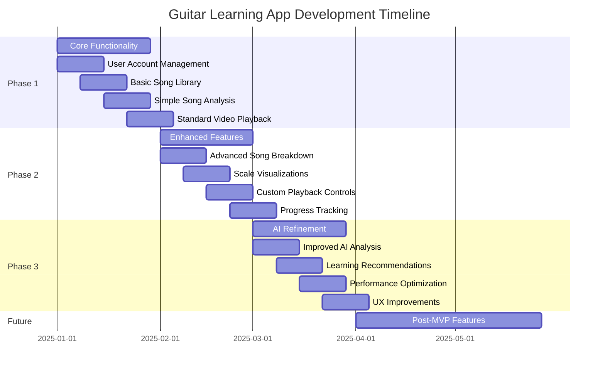

# Development Roadmap

This document outlines the development plan for the Guitar Learning App, including the MVP specifications, completed features, and planned enhancements.

## MVP Plan

### Overview
The Guitar Learning App helps users break down songs they want to learn, providing AI-generated analysis and interactive playback features to accelerate the learning process.

### Development Timeline

### User Journey

1. **Onboarding**: User creates an account and inputs their guitar skill level
2. **Song Addition**: User adds songs they want to learn to their personal library
3. **Song Analysis**: AI analyzes and breaks down the song into learnable components
4. **Practice Session**: User engages with interactive lessons and video playalongs
5. **Progress Tracking**: System tracks user improvements and provides feedback

### Core MVP Features

#### 1. Song Management
- Song library with searchable database
- Progress tracking for each song (Not Started, Learning, Comfortable)
- Difficulty ratings and estimated time to learn
- Custom tags for organization (genre, technique focus, etc.)

#### 2. AI-Generated Song Breakdown
- **Key Detection**: Automatic identification of song key and alternative suggestions
- **Scale Visualizations**: Fretboard diagrams highlighting relevant scales/modes
- **Tempo Analysis**: BPM detection, practice recommendations, metronome integration
- **Chord Diagrams**: Visual representation of all chords with alternative voicings

#### 3. Video Playback
- **Tab Playalong Integration**: Synchronized tablature with video playback
- **Enhanced Playback Controls**: Variable speed, section looping, A/B looping

## Development Phases

### Phase 1: Core Functionality (Weeks 1-4)
- User account management
- Basic song library
- Simple song analysis (key, chords)
- Standard video playback

### Phase 2: Enhanced Features (Weeks 5-8)
- Advanced song breakdown
- Interactive scale visualizations
- Custom playback controls
- Progress tracking

### Phase 3: AI Refinement (Weeks 9-12)
- Improved AI analysis accuracy
- Personalized learning recommendations
- Performance optimizations
- User experience improvements

## Completed Features

✅ Next.js application with Tailwind CSS and dark-themed responsive UI  
✅ Component structure (Sidebar, Header, Cards)  
✅ Multiple pages (Dashboard, Songs library, Song details, Practice, Progress)  
✅ Database module using localStorage for songs, practice sessions, and progress  
✅ Fixed dashboard terminology to match guitar learning context  
✅ Fixed dynamic Tailwind classes in StatsCard  
✅ Practice page with session tracking, timer, and section selection  
✅ Progress tracking page with statistics and achievements  
✅ AI song analysis service implementation (with OpenAI integration)  
✅ Web search capabilities via SERP API  
✅ Mock data fallbacks for development  
✅ Tab viewer via Songsterr integration  
✅ Fixed Songsterr tab viewer to show the correct tab for each song  
✅ Learning resources with embedded playable YouTube videos for each song  

## Planned Enhancements

### User Experience & UI
- [ ] Chord Diagram Enhancements - Add chord sound playback, alternative fingerings, and finger transition animations
- [ ] Smart Positioning - Ensure preview cards are always fully visible within viewport
- [ ] Audio Pitch Control - Add speed/pitch adjustment for practice sessions
- [ ] Loop Feature - Enable looping of difficult sections during practice
- [ ] Chromatic Tuner - Include built-in instrument tuner functionality
- [ ] Chord Sheets Export - Add PDF export of chord sheets and diagrams
- [ ] Create mobile-responsive practice mode
- [ ] Add video player with custom controls for practice sessions
- [ ] Implement metronome functionality

### Mobile & Accessibility
- [ ] Mobile Experience - Adapt hover preview functionality for touch devices with tap/hold actions
- [ ] Develop offline mode capabilities

### Core Functionality
- [ ] Enhance practice tracking functionality
- [ ] Practice Mode Integration - Add direct links between chord pages and practice features
- [ ] Song Data Enrichment - Implement automatic chord detection using Songsterr API
- [ ] Chord Progress Tracking - Allow marking specific chords as "mastered" for detailed progress
- [ ] Add customized learning path feature
- [ ] Create song search/recommendation feature
- [ ] Improve Chord Library
- [ ] Add more advanced chords and different recommendations for how to play them

### AI Features
- [ ] Implement AI chat feature for song breakdowns
- [ ] Connect AI analysis service to UI (currently implemented but not integrated)

### Data Management
- [ ] Add user authentication
- [ ] Implement cloud storage instead of localStorage
- [ ] Add user profile management
- [ ] Implement cloud sync for user data
- [ ] Add offline support - Save songs and chord diagrams for practice without internet connection

### Performance Optimization
- [ ] Implement virtualization for song lists and lazy-loading for chord diagrams

### Social Features
- [ ] Add social sharing features

## Future Enhancements (Post-MVP)
- Mobile companion app
- Community features (share progress, custom tabs)
- Live teacher integration for personalized feedback
- AI-generated backing tracks
- Gamification elements (achievements, challenges)

## Success Metrics
- User engagement (time spent practicing)
- Song completion rate
- Skill progression speed
- User satisfaction (feedback surveys)

## Technical Requirements
- Windows 10+ / macOS 10.15+ / Linux compatible
- Minimum 4GB RAM, 2GHz processor
- 500MB storage for application (excluding media files)
- Internet connection for AI features (offline mode for core functions)