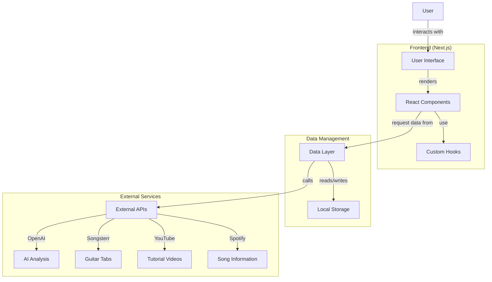

# Technical Documentation

This document provides a comprehensive overview of the Guitar Learning App's architecture, components, and implementation details.

## Core Architecture

- **Framework**: Next.js (using App Router structure)
- **Directory Structure**: `/src/app/` (main application), `/src/components/` (reusable UI components), `/src/lib/` (utilities and data layer)
- **Styling**: Tailwind CSS with custom theme
- **State Management**: React Context API and local storage

### System Architecture Diagram



## Main Components

### Data Layer

- `src/lib/db.js`: Local database implementation using localStorage
  - Manages songs, practice sessions, user preferences, chat history, chord data
  - Key functions: `getAllSongs`, `getSongById`, `addSong`, `updateSong`, `getPracticeSessions`, `saveSongAnalysis`
  - Data is persisted across sessions using browser localStorage
  - Mock data is used as fallback for development

### AI Services

- `src/lib/ai/songAnalysisService.js`: Handles song analysis with OpenAI API (with fallback to mock data)
  - Main function: `analyzeSong()` - analyzes songs and generates learning resources
  - Uses web search for additional song information when available
  - Generates chord diagrams, practice plans, and song structure analysis
  - Custom prompt engineering for music-specific output

### Pages

- `src/app/page.jsx`: Root page with welcome screen and getting started guide
- `src/app/dashboard/page.jsx`: Main dashboard with practice stats and recent songs
- `src/app/songs/page.jsx`: Song library listing with filtering and search
- `src/app/songs/[id]/page.jsx`: Individual song detail page with practice history
- `src/app/practice/page.jsx`: Chord progression practice with metronome
- `src/app/practice/[id]/page.jsx`: Focused practice page for individual songs
- `src/app/progress/page.jsx`: Progress tracking with statistics and achievements

### UI Components

- **Layout Components**:
  - `src/components/layout/PageContainer.jsx`: Main page container with navigation
  - `src/components/ui/Layout.jsx`: Application layout with sidebar and header
  - `src/components/ui/Card.jsx`: Reusable card components with subcomponents

- **Song Components**:
  - `src/components/SongsterrTab.jsx`: Displays interactive guitar tabs from Songsterr
  - `src/components/songs/AddSongForm.jsx`: Form for adding songs with AI analysis
  - `src/components/songs/QuickAddSong.jsx`: One-click song discovery and addition
  - `src/components/ui/SongItem.jsx`: Reusable song list item component
  - `src/components/songs/SongDetail.jsx`: Detailed song view with practice options

- **Practice Components**:
  - `src/components/practice/ChordProgressionPlayer.jsx`: Interactive chord progression practice tool
  - `src/components/diagrams/ChordDiagram.jsx`: Interactive guitar chord diagrams

- **Media Components**:
  - `src/components/player/VideoPlayer.jsx`: Custom video player with practice controls
  - `src/components/player/YouTubeTabPlayer.jsx`: YouTube player with synchronized tab display

- **Chart Components**:
  - `src/components/charts/LineChart.jsx`: Practice time and progress charts
  - `src/components/charts/StatsCard.jsx`: Statistical dashboard cards

- **Interactive Components**:
  - `src/components/ui/Chat.jsx`: AI chat interface for song-specific assistance
  - `src/components/ui/Modal.jsx`: Reusable modal dialog component

## Data Flow

1. **Song Management Flow**:
   - User adds songs via `AddSongForm` or `QuickAddSong`
   - Song data is saved to localStorage via `db.js`
   - Songs displayed in song list and dashboard
   - Optional AI analysis provides enhanced song details

2. **Practice Flow**:
   - User selects a song to practice from the library
   - Practice session is created and timer starts
   - User can view tabs, video, and chord diagrams
   - Practice data is saved to track progress

3. **Progress Tracking Flow**:
   - Practice sessions accumulate over time
   - Statistics calculated from session data
   - Charts and achievements update based on progress
   - Practice suggestions provided based on history

4. **Chat Interaction Flow**:
   - User asks questions about specific songs or techniques
   - App fetches relevant song context
   - OpenAI API generates tailored responses
   - Chat history saved per song for later reference

## Component Hierarchy

```
PageContainer
├── Layout
│   ├── Header
│   ├── Sidebar
│   └── [Page Content]
│       ├── Card
│       │   ├── CardHeader
│       │   ├── CardContent
│       │   └── CardFooter
│       ├── SongItem
│       ├── VideoPlayer
│       ├── ChordProgressionPlayer
│       │   └── ChordDiagram
│       └── [Other Components]
```

## Style System

The app uses a comprehensive Tailwind CSS setup with:

- Custom dark theme optimized for reading music
- Consistent color palette for UI elements
- Responsive design for desktop and mobile
- Animation using Framer Motion for transitions

## Performance Considerations

- Lazy loading of video and tab components
- Caching of API responses for song analysis
- Optimized rendering with proper React patterns
- Debounced search and filtering functions

## Debugging and Testing

- Mock data for offline development
- Test scripts for API integrations
- Browser console logging for development
- Fallback mechanisms for when APIs are unavailable

## Extension Points

Key areas where the app can be extended:

- Additional instrument support beyond guitar
- Integration with more music services
- User authentication and cloud data storage
- Social features for sharing progress
- Mobile-specific optimizations